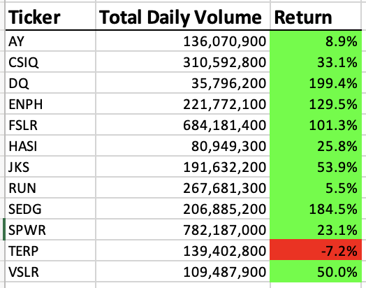
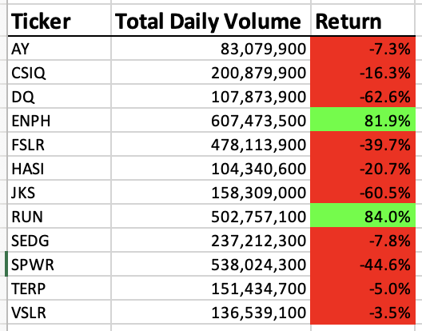
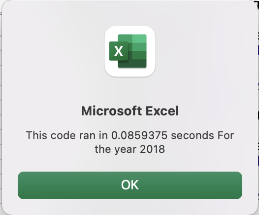
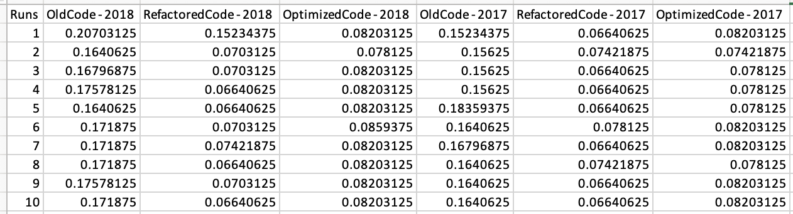

# Green Stock Analysis

## Overview of Project

This project is to analyze a set of stocks using green energy and use the results to derive to a recommendation on investment. With increased stock data to analyze, this project will also look at different opportunities to improve the performance and flexibility of the analysis approach to scale to these needs.

### Results

### Yearly Stock Performance

Comparing 2017 to 2018 we could clearly see a higher returns in 2017. Except for 1 all other stocks higher returns. Daily volume picked up in 2018 mainly for few stocks ENPH, RUN and DQ. Of them ENPH and RUN had positive returns in 2018 while DQ went negative. A risk free recommendation will be to look at ENPH with increase volume of 174% and growth after looking at its upcoming business plan. RUN looks to be on the growing side too with 88% increase in volume and 84% increase in stock price. It could be one to look to diversify the investment plan. Below are the stock analysis result images.

Analysis Results 2017      |  Analysis Results 2018
:-------------------------:|:-------------------------:
   |  
  
### Execution Time

By refactoring the code to avoid nested loops there was a significant improvement in performance. This can really help in analysing a larger number of stocks for future cases.

2017 Runtime after Refactoring      |  2018 Runtime after Refactoring 
:-------------------------:|:-------------------------:
   |  

Added one more approach without having to define the list of stocks. Using these approaches built a test process to compare performance. Results are in the below table. Code and Sheets available in the excel - [VBA_Challenge](VBA_Challenge.xlsx)

---

### Summary

### Advantages and Disadvantages of refactoring code

By refactoring code it helps in many different ways like
* Making it more efficient
* Making code more readable
* Simplify the logic as possible
* Identify better error handling 
* Use less CPU or infrastructure.

The key disadvantage with refactoring will be the time required for it as it will be a continous process. Time spent for refactoring should be taken based on the requirement and need ensuring it gives a benefit for the time spent for it. 

In certain cases refactoring to make the code efficient can increase the overall complexity of the program like using single threaded program versus a multi thread program.

### Advantages and Disadvantages of refactoring Stock Analysis

In the green stock analysis by refactoring the code we were able to improve the performance of the process by around 60%. Incases where we have to analyze a large number of stocks this refactoring will help in a very huge way. This was done by removing a nested loop and tracking all the details in an array.

By refactoring this code additional effort was needed, along with it arrays had to used requiring handling of additional variables.

A new approach was tried to not have hard coded ticker values to help in considering any stock details. Though this gave additional flexibility the performance reduced by a bit.

Overall refactoring is a very critical process and should be considered based on the need of the project to help in improving its overall efficiency.
